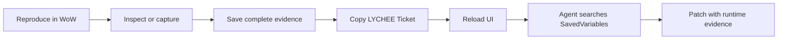

<div align="center">
  
  <h1>Lychee Dev</h1>
  <p><strong>An in-game evidence workbench for World of Warcraft addon engineers and coding agents.</strong></p>
  <p>Run Lua, inspect live objects, capture events and errors, and export complete evidence with a searchable Ticket.</p>

  <p>
    <a href="README_zhCN.md"><strong>简体中文</strong></a>
    &nbsp;|&nbsp;
    <strong>English</strong>
  </p>

  <p>
    
    
    
  </p>
  <p>
    
    
    
    
    
    
  </p>
  <p>
    <a href="#why-lychee-dev">Why Lychee Dev</a> &middot;
    <a href="#agent-workflow">Agent workflow</a> &middot;
    <a href="#supported-clients">Compatibility</a> &middot;
    <a href="#development">Development</a>
  </p>
</div>

---

## Why Lychee Dev

Most addon bugs are difficult because the useful state exists only inside a running World of Warcraft client. Lychee Dev turns that live state into evidence a developer or coding Agent can actually use:

- structured return values instead of chat-frame dumps;
- nested UI objects instead of a single frame name;
- build-correct events and argument signatures instead of a generic list;
- lifecycle-wide Lua errors with stack and local context;
- complete SavedVariables exports addressed by stable `LYCHEE-...` Tickets.

Open the workbench with `/dev`. Nothing is sent over the network.

## Workbench

| Workspace | What it answers |
| --- | --- |
| **Run** | What did this Lua return, and how is the value structured? |
| **Objects** | Which frame is under the cursor, what owns it, and what is nested below it? |
| **Events** | Which documented client events fired, with which payloads? |
| **Trace** | Who called this function, with what arguments, returns, source, and duration? |
| **Errors** | What failed across the addon lifecycle, and what evidence should be handed to an Agent? |
| **Saved Records** | Which complete report belongs to this Ticket, and has WoW written it to disk yet? |
| **Automation** | Which bounded task did an Agent deliver, did it run, and where is its result Ticket? |

## Agent workflow

Lychee Dev makes the handoff between a player, a developer, and an Agent precise.



1. Open Lychee Dev with `/dev`.
2. Reproduce the error, event sequence, or object state.
3. Click **Save** on the relevant report.
4. Give the generated `LYCHEE-YYYYMMDD-HHMMSS-NNNN` Ticket to the Agent.
5. Click **Reload UI** so World of Warcraft writes SavedVariables to disk.
6. Let the Agent search the account SavedVariables for that exact Ticket.

A useful Agent request is intentionally short:

```text
Find Ticket LYCHEE-20260820-012825-0006 in the Lychee Dev SavedVariables.
Use the complete record to identify the root cause, cite the captured state or failing
call site, and propose the smallest safe patch.
```

The record uses the versioned `lychee.evidence.v1` envelope. It includes source identity, one complete payload, client environment, creation time, and bounded feature metadata. Ticket identifiers are never reused after cache cleanup. The stable Agent lookup path is `LycheeDevDB.exports.records[TICKET].payload.content`; see [EvidenceProtocol.md](add-on/docs/EvidenceProtocol.md).

## Focused runtime investigations

Use **Run** for an explicit, bounded Lua investigation, then save its result and share the Ticket. Object inspection, event monitoring, function tracing, and error evidence remain separate tools. See [Runtime investigations](add-on/docs/RuntimeInvestigations.md) for scope, observer cost, and a single-script handoff.

The Performance page, automatic capture, function benchmarks, and profiling switch have been removed. Existing performance Tickets remain readable in **Saved Records** and through the unchanged evidence payload path. Removal does not clear history or rewrite global client settings.

## Object and event inspection

The object picker captures the frame under the cursor with `F` or `Enter`, then exposes its properties, regions, child frames, and reachable Lua fields. Large tables are paged in batches of 200 and nested nodes are created only when expanded. Any tree node can be opened separately for focused copying or export.

Event search is generated from versioned Blizzard UI sources for each supported build:

| Client catalog | Documented events |
| --- | ---: |
| Retail 12.1.0 | 1,782 |
| Classic 5.5.4 | 1,483 |
| Classic Titan 3.80.2 | 1,486 |
| WoW: Forever 1.60.1 | 1,802 |

Only explicitly selected events are registered. Searching for `ALL` or `全部` exposes the client's `RegisterAllEvents` mode, but it is never enabled by default. Monitoring stops cleanly and keeps a bounded newest-first capture list.

## Error evidence

`!BugGrabber` is a required dependency. Lychee Dev uses it for lifecycle-wide error capture and presents the evidence in its own workflow; BugSack is not required.

Errors are grouped by signature and rendered with occurrence count, client context, stack trace, and locals when available. The Agent Report view is designed for direct selection or complete Ticket export.

## Supported clients

| Client | Baseline | Interface | TOC |
| --- | --- | ---: | --- |
| Retail | 12.1.0 | `120100` | `Lychee Dev_Mainline.toc` |
| Classic | 5.5.4 | `50504` | `Lychee Dev_Mists.toc` |
| Classic Titan | 3.80.2 | `38002` | `Lychee Dev_Wrath.toc` |
| WoW: Forever (无限服) | 1.60.1 | `16001` | `Lychee Dev_Forever.toc` |

The archive ships all four TOCs. World of Warcraft selects the matching TOC, client profile, and generated event catalog while loading the shared implementation. Exact API evidence and compatibility boundaries are documented in [Compatibility.md](add-on/docs/Compatibility.md).

A client folder is a location, not an identity: the launcher reuses a test folder for whatever is on the test track, so Forever currently installs under `_classic_beta_` on that track and a dedicated `_forever_` folder is also accepted. The CLI identifies each client from its own `.flavor.info` product code and build rather than from the folder name, so a folder holding a different build is still reported correctly.

## Installation

1. Install `!BugGrabber`.
2. Copy the four TOCs and the `Core`, `Modules`, `UI`, and `Media` directories from `add-on/` into `Interface/AddOns/Lychee Dev/` in the matching client, or extract the generated ZIP into `Interface/AddOns/`. The TOC files must be directly inside `Lychee Dev`, with no nested `add-on` folder.
3. Enable Lychee Dev in the addon list.
4. Enter the world and run `/dev`.

The addon cannot be opened or used during combat. Active monitors and traces are stopped when combat begins.

## Install Lychee Dev skill

[Lychee Dev skill/SKILL.md](<Lychee Dev skill/SKILL.md>) is the versioned source for the `lychee-dev` skill. Copy that folder's contents into your agent's `skills/lychee-dev/` directory, such as `~/.codex/skills/lychee-dev/`. The visible name is **Lychee Dev skill** and the invocation is `$lychee-dev`.

Use `$lychee-dev` to describe a specific issue. The Agent prepares one bounded Run script, you execute it in `/dev`, and the Agent reads the complete saved Ticket to diagnose it. The addon runs Lua and preserves evidence; the skill plans and interprets the investigation. Installing the skill does not install or activate the addon. Small probes belong in Run; studies requiring large source bundles should use a separately verified diagnostic carrier and a short start command, not a giant paste. Input-path responsiveness and execution correctness require separate validation.

## Build an installable ZIP

```powershell
powershell -NoProfile -ExecutionPolicy Bypass -File add-on/tools/Package.ps1
```

The package is written under `add-on/publish/` with a single `Lychee Dev/` root. Only TOCs, their runtime files and media are included; tests, tools, docs, the skill and investigation data are excluded. Packaging does not install or publish it.

## Data model and limits

- Recent runs live in `LycheeDevDB.history` under a shared 16 MB budget.
- Complete exports live in `LycheeDevDB.exports.records[ticket].payload.content`.
- Export storage is bounded to 16 MB and 200 records; oldest records are pruned first.
- Text views use incremental loading for large serialized values.
- World of Warcraft writes SavedVariables only on `/reload`, logout, or exit.
- A newly created Ticket is marked pending in memory until that disk write occurs.
- Legacy `DumperDB` history is migrated automatically.

## Development

The project targets the WoW Lua 5.1 subset and keeps client differences behind explicit profiles.

```text
README.md / README_zhCN.md
add-on/
  Core/ Modules/ UI/ Media/
  Lychee Dev_*.toc
  tests/ tools/ docs/
Lychee Dev skill/
  SKILL.md
  agents/ references/
```

Run the complete matrix:

```powershell
powershell -NoProfile -ExecutionPolicy Bypass -File add-on/tests/TestAll.ps1
```

Run the exact-build static compatibility audit:

```powershell
powershell -ExecutionPolicy Bypass -File add-on/tools/AuditCompatibility.ps1
```

The suite runs 32 checks across Retail, Classic, Classic Titan, and WoW: Forever, including locale contracts, generated event catalogs, runtime behavior, UI interaction, TOC/build selection, the static-audit contract, and installable ZIP contents.

## Design constraints

- No runtime network access.
- No capture polling or feature-owned runtime event/hook machinery before the relevant opt-in tool is enabled.
- No protected-frame mutation in combat.
- No unbounded histories, captures, exports, or object walks.
- No speculative cross-build API fallback inside feature code.
- No claim of complete attribution when the WoW API cannot expose local namespaces or unreachable closures.

---

<div align="center">
  <a href="https://github.com/Follen/Lychee-Dev/issues">Report an issue</a>
  &nbsp;&middot;&nbsp;
  <a href="https://github.com/Follen/Lychee-Dev">Source code</a>
  <br><br>
  <a href="https://github.com/Follen/Lychee-Dev/stargazers"></a>
  <a href="https://github.com/Follen/Lychee-Dev/commits"></a>
  <a href="https://github.com/Follen/Lychee-Dev/issues"></a>
</div>
