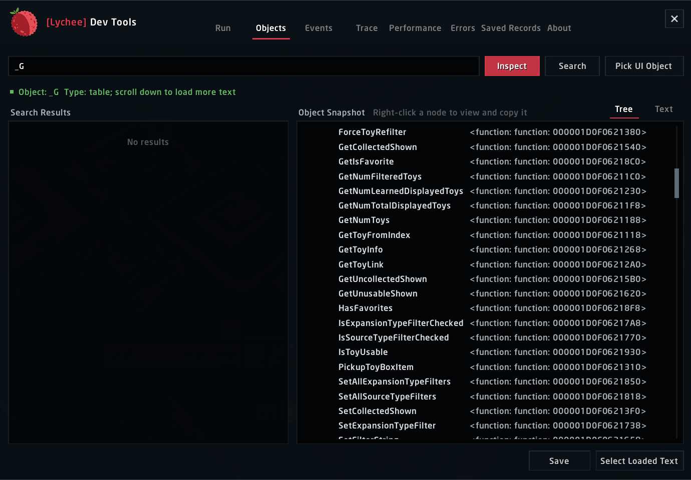
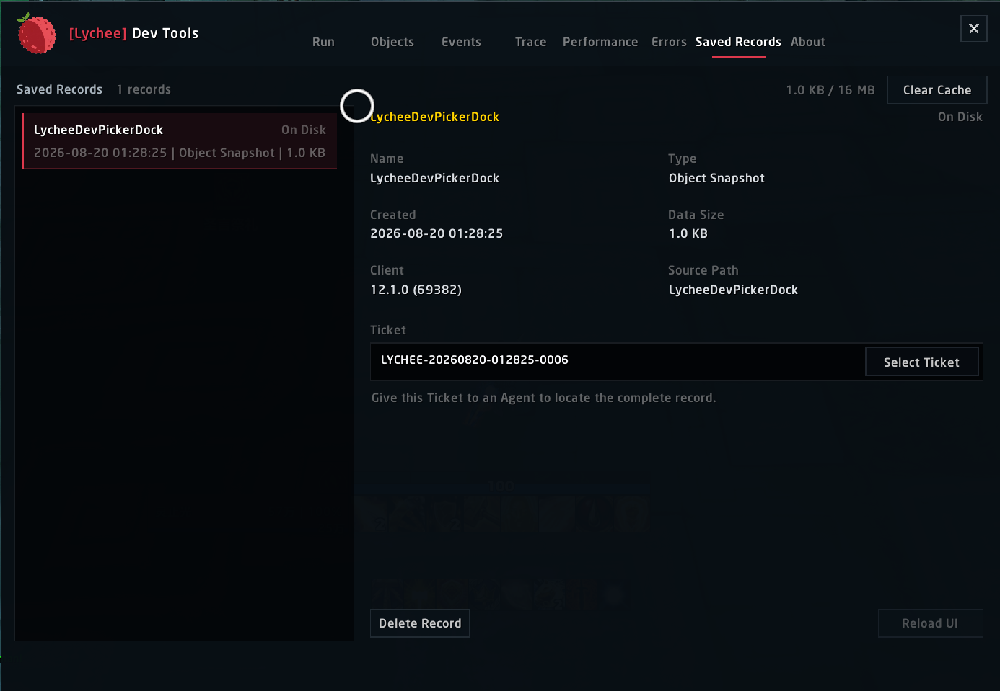
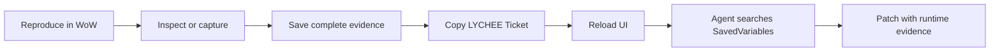

<div align="center">
  
  <h1>Lychee Dev</h1>
  <p><strong>An in-game evidence workbench for World of Warcraft addon engineers and coding agents.</strong></p>
  <p>Run Lua, inspect live objects, capture events and errors, profile real addon behavior, and export complete evidence with a searchable Ticket.</p>

  <p>
    <a href="README_zhCN.md"><strong>简体中文</strong></a>
    &nbsp;|&nbsp;
    <strong>English</strong>
  </p>

  <p>
    
    
    
  </p>
  <p>
    
    
    
    
    
    
  </p>
  <p>
    <a href="#why-lychee-dev">Why Lychee Dev</a> &middot;
    <a href="#agent-workflow">Agent workflow</a> &middot;
    <a href="#deep-performance-evidence">Performance</a> &middot;
    <a href="#supported-clients">Compatibility</a> &middot;
    <a href="#development">Development</a>
  </p>
</div>

---

## Why Lychee Dev

Most addon bugs are difficult because the useful state exists only inside a running World of Warcraft client. Lychee Dev turns that live state into evidence a developer or coding Agent can actually use:

- structured return values instead of chat-frame dumps;
- nested UI objects instead of a single frame name;
- build-correct events and argument signatures instead of a generic list;
- lifecycle-wide Lua errors with stack and local context;
- bounded performance captures with hot paths, object signals, pool reuse, closure churn, SavedVariables growth, and collector overhead;
- complete SavedVariables exports addressed by stable `LYCHEE-...` Tickets.

Open the workbench with `/dev`. Nothing is sent over the network.

## Workbench

| Workspace | What it answers |
| --- | --- |
| **Run** | What did this Lua return, and how is the value structured? |
| **Objects** | Which frame is under the cursor, what owns it, and what is nested below it? |
| **Events** | Which documented client events fired, with which payloads? |
| **Trace** | Who called this function, with what arguments, returns, source, and duration? |
| **Performance** | Which addon, function, frame script, object pattern, or persistent structure is producing the cost? |
| **Errors** | What failed across the addon lifecycle, and what evidence should be handed to an Agent? |
| **Saved Records** | Which complete report belongs to this Ticket, and has WoW written it to disk yet? |

<table>
  <tr>
    <td width="50%"></td>
    <td width="50%"></td>
  </tr>
  <tr>
    <td align="center"><sub>Incremental object inspection with expandable structure</sub></td>
    <td align="center"><sub>Complete evidence addressed by a stable Agent Ticket</sub></td>
  </tr>
</table>

## Agent workflow

Lychee Dev makes the handoff between a player, a developer, and an Agent precise.



1. Open Lychee Dev with `/dev`.
2. Reproduce the error, event sequence, object state, or performance issue.
3. Click **Save** on the relevant report.
4. Give the generated `LYCHEE-YYYYMMDD-HHMMSS-NNNN` Ticket to the Agent.
5. Click **Reload UI** so World of Warcraft writes SavedVariables to disk.
6. Let the Agent search the account SavedVariables for that exact Ticket.

A useful Agent request is intentionally short:

```text
Find Ticket LYCHEE-20260820-012825-0006 in the Lychee Dev SavedVariables.
Use the complete record to identify the root cause, cite the hot path or failing
call site, and propose the smallest safe patch.
```

The record uses the versioned `lychee.evidence.v1` envelope. It includes source identity, one complete payload, client environment, creation time, and bounded feature metadata. Ticket identifiers are never reused after cache cleanup. The stable Agent lookup path is `LycheeDevDB.exports.records[TICKET].payload.content`; see [EvidenceProtocol.md](docs/EvidenceProtocol.md).

## Deep performance evidence

Lychee Dev does not reduce addon performance to one cumulative CPU number. A recording stays scoped to one selected addon and correlates several evidence layers over the same bounded interval:

- current, encounter, peak, and session CPU from `C_AddOnProfiler`;
- P50, P95, P99, maximum, spike thresholds, and relative client load;
- function self time, inclusive time, call count, and average cost;
- attributed Frame scripts and `OnUpdate` activity;
- reachable object counts, types, visibility transitions, and newly observed objects;
- recognizable object-pool capacity, acquire/release movement, and reuse signals;
- function identity replacement at stable paths as a closure-churn signal;
- declared SavedVariables structure growth during the capture;
- analyzer overhead and explicit coverage limits.

Deep capture is opt-in. Its sampler is created only when recording begins and is cancelled immediately when recording stops, the window closes, or combat starts. The separate Function Lab uses `C_AddOnProfiler.MeasureCall` to execute an explicitly selected repeatable function and report timing plus allocation evidence.

## Object and event inspection

The object picker captures the frame under the cursor with `F` or `Enter`, then exposes its properties, regions, child frames, and reachable Lua fields. Large tables are paged in batches of 200 and nested nodes are created only when expanded. Any tree node can be opened separately for focused copying or export.

Event search is generated from versioned Blizzard UI sources for each supported build:

| Client catalog | Documented events |
| --- | ---: |
| Retail 12.1.0 | 1,782 |
| Classic 5.5.4 | 1,483 |
| Classic Titan 3.80.2 | 1,486 |

Only explicitly selected events are registered. Searching for `ALL` or `全部` exposes the client's `RegisterAllEvents` mode, but it is never enabled by default. Monitoring stops cleanly and keeps a bounded newest-first capture list.

## Error evidence

`!BugGrabber` is a required dependency. Lychee Dev uses it for lifecycle-wide error capture and presents the evidence in its own workflow; BugSack is not required.

Errors are grouped by signature and rendered with occurrence count, client context, stack trace, and locals when available. The Agent Report view is designed for direct selection or complete Ticket export.

## Supported clients

| Client | Baseline | Interface | TOC |
| --- | --- | ---: | --- |
| Retail | 12.1.0 | `120100` | `Lychee Dev_Mainline.toc` |
| Classic | 5.5.4 | `50504` | `Lychee Dev_Mists.toc` |
| Classic Titan | 3.80.2 | `38002` | `Lychee Dev_Wrath.toc` |

The archive ships all three TOCs. World of Warcraft selects the matching TOC, client profile, and generated event catalog while loading the shared implementation. Exact API evidence and compatibility boundaries are documented in [Compatibility.md](docs/Compatibility.md).

## Installation

1. Install `!BugGrabber`.
2. Place the `Lychee Dev` folder in the matching World of Warcraft `Interface/AddOns` directory.
3. Enable Lychee Dev in the addon list.
4. Enter the world and run `/dev`.

The addon cannot be opened or used during combat. Active monitors, traces, and captures are stopped when combat begins.

## Data model and limits

- Recent runs live in `LycheeDevDB.history` under a shared 16 MB budget.
- Complete exports live in `LycheeDevDB.exports.records[ticket].payload.content`.
- Export storage is bounded to 16 MB and 200 records; oldest records are pruned first.
- Text views use incremental loading for large serialized values.
- World of Warcraft writes SavedVariables only on `/reload`, logout, or exit.
- A newly created Ticket is marked pending in memory until that disk write occurs.
- Legacy `DumperDB` history is migrated automatically.

## Development

The project targets the WoW Lua 5.1 subset and keeps client differences behind explicit profiles.

```text
Core/                  compatibility, persistence, serialization, safety
Core/Clients/          build-specific API profiles
Modules/               diagnostics, tracing, performance, object inspection
Modules/Events/        generated catalogs plus bounded monitoring runtime
UI/                    shared widgets, export flow, pages, main window
tests/                 standalone Lua tests and the three-client matrix
```

Run the complete matrix:

```powershell
powershell -NoProfile -ExecutionPolicy Bypass -File tests/TestAll.ps1
```

Run the exact-build static compatibility audit:

```powershell
powershell -ExecutionPolicy Bypass -File tools/AuditCompatibility.ps1
```

The suite runs 20 checks across Retail, Classic, and Classic Titan, including locale contracts, generated event catalogs, runtime behavior, UI interaction, TOC/build selection, and the static-audit contract.

## Design constraints

- No runtime network access.
- No capture polling or feature-owned runtime event/hook machinery before the relevant opt-in tool is enabled.
- No protected-frame mutation in combat.
- No unbounded histories, captures, exports, or object walks.
- No speculative cross-build API fallback inside feature code.
- No claim of complete attribution when the WoW API cannot expose local namespaces or unreachable closures.

---

<div align="center">
  <a href="https://github.com/Follen/Lychee-Dev/issues">Report an issue</a>
  &nbsp;&middot;&nbsp;
  <a href="https://github.com/Follen/Lychee-Dev">Source code</a>
  <br><br>
  <a href="https://github.com/Follen/Lychee-Dev/stargazers"></a>
  <a href="https://github.com/Follen/Lychee-Dev/commits"></a>
  <a href="https://github.com/Follen/Lychee-Dev/issues"></a>
</div>
