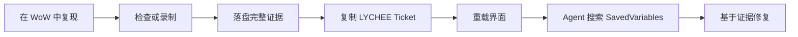

<div align="center">
  
  <h1>荔枝开发工具</h1>
  <p><strong>面向魔兽世界插件程序员与编程 Agent 的游戏内证据工作台。</strong></p>
  <p>运行 Lua、检查实时对象、抓取事件与错误，并用可搜索的 Ticket 导出完整证据。</p>

  <p>
    <strong>简体中文</strong>
    &nbsp;|&nbsp;
    <a href="README.md"><strong>English</strong></a>
  </p>

  <p>
    
    
    
  </p>
  <p>
    
    
    
    
    
    
  </p>
  <p>
    <a href="#为什么需要荔枝开发工具">项目定位</a> &middot;
    <a href="#agent-工作流">Agent 工作流</a> &middot;
    <a href="#支持客户端">兼容性</a> &middot;
    <a href="#参与开发">参与开发</a>
  </p>
</div>

---

## 为什么需要荔枝开发工具

很多插件问题并不是 Lua 难写，而是关键状态只存在于正在运行的魔兽世界客户端中。荔枝开发工具负责把这些实时状态转化为程序员和编程 Agent 真正能使用的证据：

- 用结构化返回值替代聊天框刷屏；
- 抓取嵌套界面对象，而不是只给一个 Frame 名称；
- 按客户端构建提供准确事件与参数签名；
- 记录插件完整生命周期内的 Lua 错误、调用栈与局部变量；
- 将完整数据保存到 SavedVariables，并用稳定的 `LYCHEE-...` Ticket 定位。

游戏内输入 `/dev` 打开。插件不会上传任何数据。

## 工作台

| 页面 | 它解决的问题 |
| --- | --- |
| **运行** | 这段 Lua 返回了什么，数据结构是什么？ |
| **对象** | 鼠标下是什么 Frame、由谁持有、内部还嵌套了什么？ |
| **事件** | 当前客户端有哪些官方事件，实际触发时携带了什么参数？ |
| **追踪** | 谁调用了这个函数，参数、返回值、来源和耗时是什么？ |
| **诊断** | 插件生命周期中发生了什么错误，应该把哪些证据交给 Agent？ |
| **落盘记录** | 这个 Ticket 对应哪份完整报告，WoW 是否已经把它写入磁盘？ |
| **自动化** | Agent 投递了哪个有界任务，是否已执行，结果 Ticket 在哪里？ |

## Agent 工作流

荔枝开发工具让玩家、插件程序员和 Agent 之间的交接变得精确。



1. 输入 `/dev` 打开荔枝开发工具。
2. 复现错误、事件序列或对象状态。
3. 在对应报告中点击 **落盘**。
4. 把生成的 `LYCHEE-YYYYMMDD-HHMMSS-NNNN` Ticket 交给 Agent。
5. 点击 **重载界面**，让魔兽世界把 SavedVariables 写入磁盘。
6. 让 Agent 在账号 SavedVariables 中搜索这个 Ticket。

给 Agent 的请求可以非常短：

```text
在荔枝开发工具 SavedVariables 中找到 Ticket LYCHEE-20260820-012825-0006。
使用完整记录定位根因，引用对应状态或失败调用点，并给出最小安全修复。
```

记录使用带版本的 `lychee.evidence.v1` 结构，包含来源标识、唯一一份完整数据、客户端环境、创建时间和受限的功能元数据。清理缓存后 Ticket 编号也不会复用。Agent 的稳定读取路径为 `LycheeDevDB.exports.records[TICKET].payload.content`，完整协议见 [EvidenceProtocol.md](add-on/docs/EvidenceProtocol.md)。

## 有边界的运行时调查

使用 **运行** 执行明确、有界的 Lua 调查，将结果落盘后交出 Ticket。对象检查、事件监听、函数追踪和错误诊断仍是独立工具。测量口径、观察器成本与一次脚本交接说明见 [运行时调查](add-on/docs/RuntimeInvestigations.md)。

性能页面、自动录制、函数性能实验和 profiling 开关已移除。既有性能 Ticket 仍能在 **落盘记录** 中查看，完整 payload 路径保持不变。删除功能不会清空历史，也不会改写客户端全局设置。

## 对象与事件

对象拾取器在鼠标指向目标后使用 `F` 或 `Enter` 抓取，随后展示属性、区域、子 Frame 和可达 Lua 字段。大型表每批加载 200 项，嵌套节点只在展开时创建。任意树形节点都可以单独打开、复制或落盘。

事件搜索目录来自每个构建对应的版本化 Blizzard UI 源码：

| 客户端事件目录 | 官方事件数 |
| --- | ---: |
| 正式服 12.1.0 | 1,782 |
| 经典版 5.5.4 | 1,483 |
| 经典泰坦 3.80.2 | 1,486 |
| 无限服 1.60.1 | 1,802 |

只有用户明确选择的事件才会注册。搜索 `ALL` 或 `全部` 可以进入当前客户端的 `RegisterAllEvents` 模式，但它永远不会默认开启。停止监听后会完整注销，抓取列表也有明确上限。

## 错误证据

`!BugGrabber` 是必需依赖。荔枝开发工具使用它完成全生命周期错误采集，并提供自己的查看、筛选、Agent 报告与落盘流程；不依赖 BugSack。

错误按签名归组，并展示出现次数、客户端上下文、调用栈和可用的局部变量。Agent 报告既可以直接全选，也可以用 Ticket 导出完整内容。

## 支持客户端

| 客户端 | 基线版本 | Interface | TOC |
| --- | --- | ---: | --- |
| 正式服 | 12.1.0 | `120100` | `Lychee Dev_Mainline.toc` |
| 经典版 | 5.5.4 | `50504` | `Lychee Dev_Mists.toc` |
| 经典泰坦 | 3.80.2 | `38002` | `Lychee Dev_Wrath.toc` |
| 无限服 | 1.60.1 | `16001` | `Lychee Dev_Forever.toc` |

发布包同时包含四个 TOC。魔兽世界会选择匹配的 TOC、客户端配置和生成事件目录，其他实现保持共享。准确的 API 证据与兼容边界见 [Compatibility.md](add-on/docs/Compatibility.md)。

客户端目录只是位置，不代表身份：启动器会把测试轨道的客户端放进复用的目录，因此无限服目前安装在 `_classic_beta_` 下，同时也接受独立的 `_forever_` 目录。CLI 通过客户端自身的 `.flavor.info` 产品码和构建号识别，而不是靠目录名，所以同一目录里换了别的构建也能被正确识别。

## 安装

1. 安装 `!BugGrabber`。
2. 将 `add-on/` 内的四个 TOC 和 `Core`、`Modules`、`UI`、`Media` 目录放入对应客户端的 `Interface/AddOns/Lychee Dev/`，或将构建出的 ZIP 解压到 `Interface/AddOns/`。TOC 必须直接位于 `Lychee Dev` 下，不能额外嵌套 `add-on` 目录。
3. 在插件列表启用荔枝开发工具。
4. 进入游戏后输入 `/dev`。

战斗中无法打开或使用荔枝开发工具。进入战斗时，正在运行的监听和追踪都会停止。

## 安装 Lychee Dev skill

[Lychee Dev skill/SKILL.md](<Lychee Dev skill/SKILL.md>) 是仓库内可追踪的 `lychee-dev` 技能源。将该目录内容复制到 Agent 的 `skills/lychee-dev/`，例如 `~/.codex/skills/lychee-dev/`。显示名称为 **Lychee Dev skill**，实际调用名为 `$lychee-dev`。

使用 `$lychee-dev` 描述具体问题：Agent 准备一份有界脚本，你在 `/dev` 的运行页执行，再由 Agent 读取完整 Ticket 报告分析。插件负责运行和留证，技能负责设计调查与解释结果；安装技能不会自动安装或启动游戏插件。简单探针用运行页；需要大量源码的统一测试使用单独验证的诊断载体与短启动命令，避免巨型粘贴。输入路径是否流畅和脚本执行是否正确需要分别验证。

## 构建安装包

```powershell
powershell -NoProfile -ExecutionPolicy Bypass -File add-on/tools/Package.ps1
```

安装包输出到 `add-on/publish/`，ZIP 顶层只有 `Lychee Dev/`。只包含 TOC、运行文件和媒体，不包含 tests、tools、docs、技能或调查数据。打包不会安装或发布插件。

## 数据结构与限制

- 最近运行历史位于 `LycheeDevDB.history`，共享 16 MB 预算。
- 完整落盘数据位于 `LycheeDevDB.exports.records[ticket].payload.content`。
- 落盘缓存限制为 16 MB 和 200 条记录，优先移除最旧数据。
- 超大序列化内容采用增量文本加载。
- 魔兽世界只会在 `/reload`、退出角色或关闭游戏时写入 SavedVariables。
- 新 Ticket 在本次运行中保持“待落盘”，直到发生磁盘写入。
- 旧 `DumperDB` 历史会自动迁移。

## 参与开发

项目使用 WoW Lua 5.1 子集，并通过明确的客户端配置隔离构建差异。

```text
README.md / README_zhCN.md
add-on/
  Core/ Modules/ UI/ Media/
  Lychee Dev_*.toc
  tests/ tools/ docs/
Lychee Dev skill/
  SKILL.md
  agents/ references/
```

运行完整测试：

```powershell
powershell -NoProfile -ExecutionPolicy Bypass -File add-on/tests/TestAll.ps1
```

运行四端精确构建静态兼容审计：

```powershell
powershell -ExecutionPolicy Bypass -File add-on/tools/AuditCompatibility.ps1
```

测试矩阵在正式服、经典版、经典泰坦和无限服上运行 32 项检查，覆盖语言契约、生成事件目录、运行时行为、UI 交互、TOC/构建选择、静态审计契约和安装包结构。

## 设计边界

- 运行时不访问网络。
- 用户未开启对应工具时，不启动抓取轮询，也不注册该功能拥有的运行时事件或 Hook。
- 战斗中不修改受保护 Frame。
- 历史、抓取、落盘和对象遍历都有明确上限。
- 功能代码中不保留猜测性的跨构建 API 回退。
- WoW API 无法暴露局部命名空间或不可达闭包时，报告会明确说明覆盖限制。

---

<div align="center">
  <a href="https://github.com/Follen/Lychee-Dev/issues">提交问题</a>
  &nbsp;&middot;&nbsp;
  <a href="https://github.com/Follen/Lychee-Dev">查看源码</a>
  <br><br>
  <a href="https://github.com/Follen/Lychee-Dev/stargazers"></a>
  <a href="https://github.com/Follen/Lychee-Dev/commits"></a>
  <a href="https://github.com/Follen/Lychee-Dev/issues"></a>
</div>
