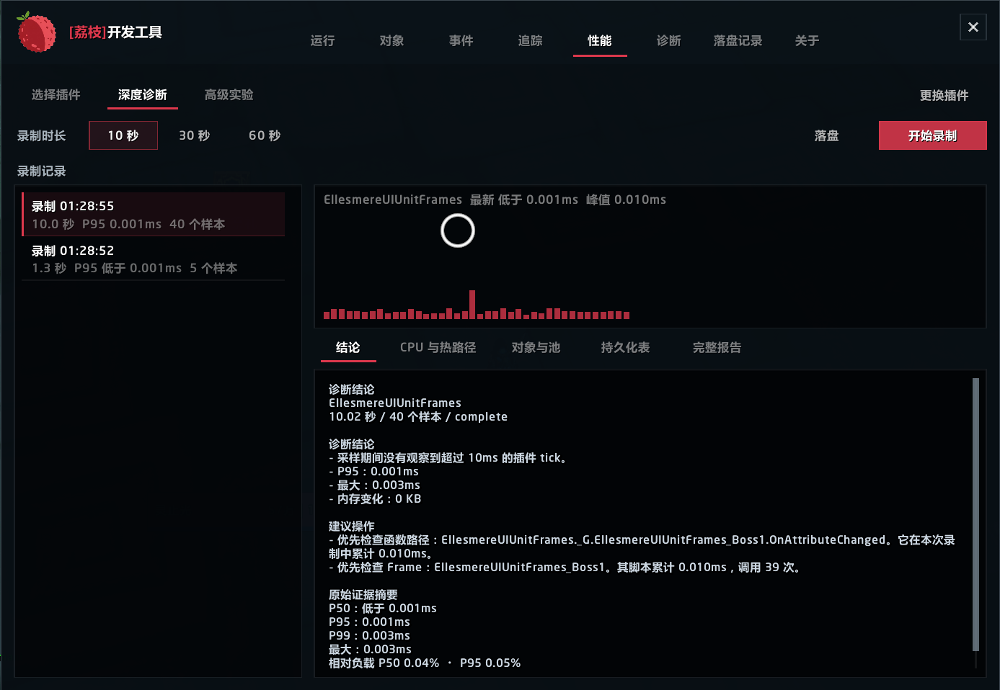
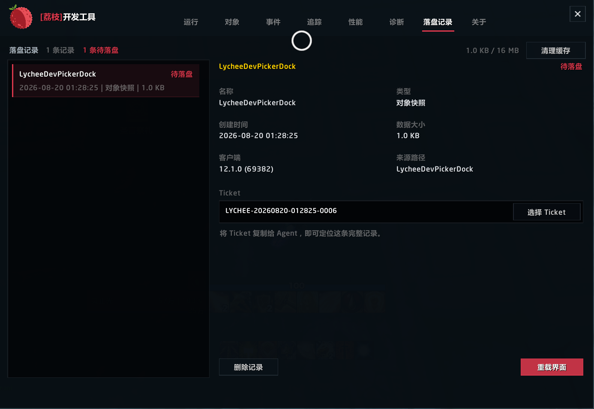
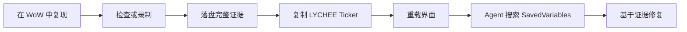

<div align="center">
  
  <h1>荔枝开发工具</h1>
  <p><strong>面向魔兽世界插件程序员与编程 Agent 的游戏内证据工作台。</strong></p>
  <p>运行 Lua、检查实时对象、抓取事件与错误、分析插件性能，并用可搜索的 Ticket 导出完整证据。</p>

  <p>
    <strong>简体中文</strong>
    &nbsp;|&nbsp;
    <a href="README.md"><strong>English</strong></a>
  </p>

  <p>
    
    
    
  </p>
  <p>
    
    
    
    
    
    
  </p>
  <p>
    <a href="#为什么需要荔枝开发工具">项目定位</a> &middot;
    <a href="#agent-工作流">Agent 工作流</a> &middot;
    <a href="#深度性能证据">性能分析</a> &middot;
    <a href="#支持客户端">兼容性</a> &middot;
    <a href="#参与开发">参与开发</a>
  </p>
</div>

---

## 为什么需要荔枝开发工具

很多插件问题并不是 Lua 难写，而是关键状态只存在于正在运行的魔兽世界客户端中。荔枝开发工具负责把这些实时状态转化为程序员和编程 Agent 真正能使用的证据：

- 用结构化返回值替代聊天框刷屏；
- 抓取嵌套界面对象，而不是只给一个 Frame 名称；
- 按客户端构建提供准确事件与参数签名；
- 记录插件完整生命周期内的 Lua 错误、调用栈与局部变量；
- 在同一段录制中关联热路径、对象、对象池、闭包变化、SavedVariables 增长和分析器开销；
- 将完整数据保存到 SavedVariables，并用稳定的 `LYCHEE-...` Ticket 定位。

游戏内输入 `/dev` 打开。插件不会上传任何数据。

## 工作台

| 页面 | 它解决的问题 |
| --- | --- |
| **运行** | 这段 Lua 返回了什么，数据结构是什么？ |
| **对象** | 鼠标下是什么 Frame、由谁持有、内部还嵌套了什么？ |
| **事件** | 当前客户端有哪些官方事件，实际触发时携带了什么参数？ |
| **追踪** | 谁调用了这个函数，参数、返回值、来源和耗时是什么？ |
| **性能** | 哪个插件、函数、Frame 脚本、对象模式或持久化结构正在制造开销？ |
| **诊断** | 插件生命周期中发生了什么错误，应该把哪些证据交给 Agent？ |
| **落盘记录** | 这个 Ticket 对应哪份完整报告，WoW 是否已经把它写入磁盘？ |

<table>
  <tr>
    <td width="50%"></td>
    <td width="50%"></td>
  </tr>
  <tr>
    <td align="center"><sub>以插件为维度关联多层性能证据</sub></td>
    <td align="center"><sub>完整数据、磁盘状态与稳定 Ticket</sub></td>
  </tr>
</table>

## Agent 工作流

荔枝开发工具让玩家、插件程序员和 Agent 之间的交接变得精确。



1. 输入 `/dev` 打开荔枝开发工具。
2. 复现错误、事件序列、对象状态或性能问题。
3. 在对应报告中点击 **落盘**。
4. 把生成的 `LYCHEE-YYYYMMDD-HHMMSS-NNNN` Ticket 交给 Agent。
5. 点击 **重载界面**，让魔兽世界把 SavedVariables 写入磁盘。
6. 让 Agent 在账号 SavedVariables 中搜索这个 Ticket。

给 Agent 的请求可以非常短：

```text
在荔枝开发工具 SavedVariables 中找到 Ticket LYCHEE-20260820-012825-0006。
使用完整记录定位根因，引用对应热路径或失败调用点，并给出最小安全修复。
```

记录中包含数据类型、标题、完整序列化内容、字节数、创建时间、客户端构建、语言、来源路径和受限的可搜索元数据。清理缓存后 Ticket 编号也不会复用。

## 深度性能证据

荔枝开发工具不会把插件性能简化成一个累计 CPU 数字。每次录制始终锁定一个目标插件，并在同一个受限时间段内关联多层证据：

- `C_AddOnProfiler` 提供的近期、首领战、峰值和会话 CPU；
- P50、P95、P99、最大值、尖峰阈值和相对客户端负载；
- 函数自身耗时、包含耗时、调用次数和平均耗时；
- 可归属的 Frame 脚本与 `OnUpdate` 活动；
- 可达对象数量、类型、显隐变化和新观察对象；
- 可识别对象池的容量、获取/释放变化和复用信号；
- 稳定路径上的函数身份替换，用于提示闭包重复创建；
- 录制期间声明的 SavedVariables 结构增长；
- 分析器自身开销和明确的覆盖限制。

深度录制默认关闭。只有开始录制时才会创建采样器；停止录制、关闭窗口或进入战斗后会立即取消。独立的高级实验使用 `C_AddOnProfiler.MeasureCall` 主动执行一个明确选择、可重复调用的函数，并报告耗时与内存分配证据。

## 对象与事件

对象拾取器在鼠标指向目标后使用 `F` 或 `Enter` 抓取，随后展示属性、区域、子 Frame 和可达 Lua 字段。大型表每批加载 200 项，嵌套节点只在展开时创建。任意树形节点都可以单独打开、复制或落盘。

事件搜索目录来自每个构建对应的版本化 Blizzard UI 源码：

| 客户端事件目录 | 官方事件数 |
| --- | ---: |
| 正式服 12.1.0 | 1,782 |
| 经典版 5.5.4 | 1,483 |
| 经典泰坦 3.80.2 | 1,486 |

只有用户明确选择的事件才会注册。搜索 `ALL` 或 `全部` 可以进入当前客户端的 `RegisterAllEvents` 模式，但它永远不会默认开启。停止监听后会完整注销，抓取列表也有明确上限。

## 错误证据

`!BugGrabber` 是必需依赖。荔枝开发工具使用它完成全生命周期错误采集，并提供自己的查看、筛选、Agent 报告与落盘流程；不依赖 BugSack。

错误按签名归组，并展示出现次数、客户端上下文、调用栈和可用的局部变量。Agent 报告既可以直接全选，也可以用 Ticket 导出完整内容。

## 支持客户端

| 客户端 | 基线版本 | Interface | TOC |
| --- | --- | ---: | --- |
| 正式服 | 12.1.0 | `120100` | `Lychee Dev_Mainline.toc` |
| 经典版 | 5.5.4 | `50504` | `Lychee Dev_Mists.toc` |
| 经典泰坦 | 3.80.2 | `38002` | `Lychee Dev_Wrath.toc` |

发布包同时包含三个 TOC。魔兽世界会选择匹配的 TOC、客户端配置和生成事件目录，其他实现保持共享。准确的 API 证据与兼容边界见 [Compatibility.md](docs/Compatibility.md)。

## 安装

1. 安装 `!BugGrabber`。
2. 将 `Lychee Dev` 文件夹放入对应魔兽世界客户端的 `Interface/AddOns` 目录。
3. 在插件列表启用荔枝开发工具。
4. 进入游戏后输入 `/dev`。

战斗中无法打开或使用荔枝开发工具。进入战斗时，正在运行的监听、追踪和录制都会停止。

## 数据结构与限制

- 最近运行历史位于 `LycheeDevDB.history`，共享 16 MB 预算。
- 完整落盘数据位于 `LycheeDevDB.exports.records[ticket]`。
- 落盘缓存限制为 16 MB 和 200 条记录，优先移除最旧数据。
- 超大序列化内容采用增量文本加载。
- 魔兽世界只会在 `/reload`、退出角色或关闭游戏时写入 SavedVariables。
- 新 Ticket 在本次运行中保持“待落盘”，直到发生磁盘写入。
- 旧 `DumperDB` 历史会自动迁移。

## 参与开发

项目使用 WoW Lua 5.1 子集，并通过明确的客户端配置隔离构建差异。

```text
Core/                  兼容边界、持久化、序列化与安全
Core/Clients/          各构建 API 配置
Modules/               诊断、追踪、性能与对象检查
Modules/Events/        生成事件目录与受限监听运行时
UI/                    共享控件、落盘流程、页面与主窗口
tests/                 独立 Lua 测试和三客户端矩阵
```

运行完整测试：

```powershell
powershell -NoProfile -ExecutionPolicy Bypass -File tests/TestAll.ps1
```

测试矩阵在正式服、经典版和经典泰坦上运行 19 项检查，覆盖语言契约、生成事件目录、运行时行为、UI 交互和 TOC/构建选择。

## 设计边界

- 运行时不访问网络。
- 用户未开启对应工具时，不启动抓取轮询，也不注册该功能拥有的运行时事件或 Hook。
- 战斗中不修改受保护 Frame。
- 历史、抓取、落盘和对象遍历都有明确上限。
- 功能代码中不保留猜测性的跨构建 API 回退。
- WoW API 无法暴露局部命名空间或不可达闭包时，报告会明确说明覆盖限制。

---

<div align="center">
  <a href="https://github.com/Follen/Lychee-Dev/issues">提交问题</a>
  &nbsp;&middot;&nbsp;
  <a href="https://github.com/Follen/Lychee-Dev">查看源码</a>
  <br><br>
  <a href="https://github.com/Follen/Lychee-Dev/stargazers"></a>
  <a href="https://github.com/Follen/Lychee-Dev/commits"></a>
  <a href="https://github.com/Follen/Lychee-Dev/issues"></a>
</div>
